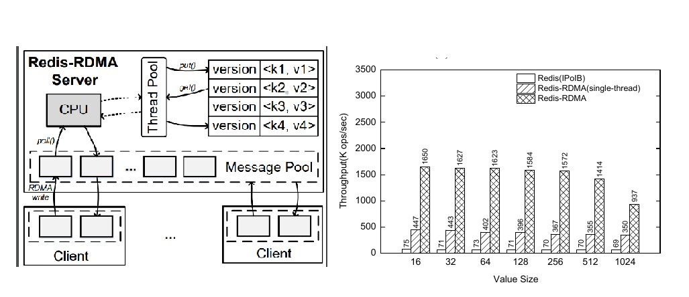

# 目录

####  Personal Information 

Office: Room 314, The Geographical Building, East China Normal University(ECNU), Shanghai, China

Email: hqhu@dase.ecnu.edu.cn

Short bio: I got my bachelor's degree at Xidian University and I recieved my Phd's degree at Tsinghua University supervised by Prof Jianhua Feng and Prof. Guoliang Li (<http://dbgroup.cs.tsinghua.edu.cn/ligl/>). Now I'm an associate professor at School of Data Science and Engineering (**DASE**), East China Normal University (**ECNU**). My main research interests are database and distributed systems.

###### Teachings

* Implementation of Database Systems

* Data structure and Algorithms

###### Readings for Students

* [Reading](https://github.com/dase314ecnu/huiqihu.github.io/blob/master/readings/reading2020.pdf)

####  Lab Dase-314

I run a small lab studying database and distributed systems. Our research area includes: storage, in-memory and parallel computing,  transaction processing and distributed consensus. In the lab, we prefer study open-sourced systems or open-sourced projects. The students are engaged in research/engineering in systems.

Specifically, my recent interests include:

* distributed storage system, LSM-tree structured storage system with new hardwares (RDMA and NVM)

* cloud-based database, multi-master and shared memory buffer, distributed transaction over database replicas

#### Blob  

[小链接](https://github.com/dase314ecnu/huiqihu.github.io/blob/master/template/1.md)
<!-- 链接图片 -->
</img>
