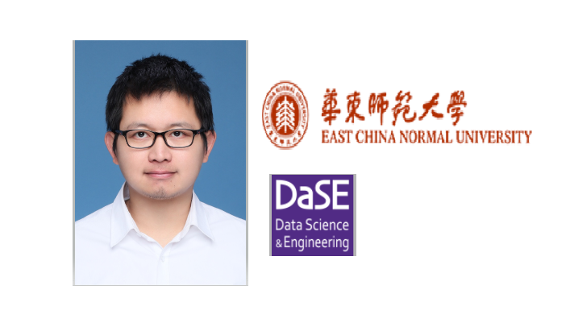
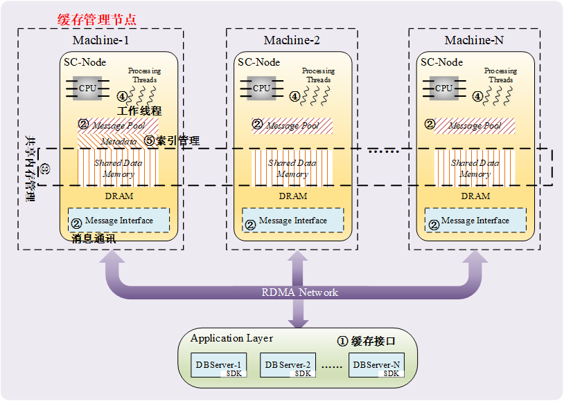

##  Huiqi Hu @ DASE-314

#### Personal Information

Office: Room 314, The Geographical Building, East China Normal University(ECNU), Shanghai, China

Email: hqhu@dase.ecnu.edu.cn

Short bio: I got my bachelor's degree at Xidian University and I recieved my Phd's degree at Tsinghua University supervised by Prof. Guoliang Li (<http://dbgroup.cs.tsinghua.edu.cn/ligl/>). Now I'm an assistant professor at School of Data Science and Engineering (**DASE**), East China Normal University (**ECNU**). My main research interests are database and distributed systems and algorithms.

####  Blog & Readings of Papers 

See [Readings](/readings/list.md) for a list. Welcome to discuss about database and distributed system with us.  

####  Lab Dase-314

I run a small lab studying database and distributed systems. Our research area includes: storage, in-memory and parallel computing,  query processing and optimization, transaction processing. In the lab, we prefer study open-sourced systems or open-sourced projects. 

Specifically, my recent interests include distributed storage system and indexes with new hardwares(RDMA and NVM), parallel logging with varients of Paxos/Raft protocols, indexing and increamental view maintenance for kv/database/streaming systems.  

The students are engaged in research/engineering in systems. A list of students from our Lab:

* PHD candidates
  * Huichao Duan
  * Xing Wei
  * Chengcheng Huang
  * Xuecheng Qi

* Master degree candidates
  * Yanzhao Wang
  * Wencan Yang
  * Zihang Zhang
  * Yaoyi Hu
  * Zihao Liu
  * Rui Xu

* Graduated Students
  * Dr. Tao Zhu @ Alibaba
  * Dr. Huan Zhou @ ECNU 
  * Xing Qu @ Halo Cooperation
  * Xiaoxiao Mao @ Tencent
  * Jianwei Huang @ China UnionPay
  * Tianyang Jin @ startup 
  * Suxiang Wang @ Bank of Communication
  * Shuanglong Wang @ ICBC

#### Teachings

* Implementation of Database Systems

* Data structure and Algorithms

#### Projects 

* **Shared-cache**: A high-performance distributed cache with RDMA and NVM. Shared-cache uses NVM and RDMA to provides a global cache layer between computation and storage. As RDMA for remote access is more efficient than local access on SSD, the key idea is to replace or assist local cache with the high-performance shared cache through network.  SC is a block-level cache, where data are organized as blocks.  The program  is currently in progress. The code is avaiable at : <https://github.com/dase314ecnu/RDMA-Unified-Shared-Memory>

* **RDMA-Redis**: A RMDA equipped Redis system. The system is a forked branch of the Redis system, which is the most popular in-memory key-value stores enabling high-performance caching.  The existing implementation of Redis is built upon socket interface that remains heavy memory copy overhead within the kernel and considerable CPU overhead to maintain socket connections. RDMA-redis augment Redis with RDMA. We also enable Redis to handle multi-threaded execution and cope with concurrent conflicts.  Redis-RDMA achieves orders-of-magnitude better throughput - up to 2.78 million operations per second and ultra-low latency  down to 10 us per operator on a single machine.  The code is available at <https://github.com/dase314ecnu/RDMA-Redis>. 

* **Cedar**: a scalable RDBMS built on distributed LSM-structure. The system has many successfull application in industry companies. 
The system is avaiable at <https://github.com/daseECNU/Cedar/commits/master>.  The paper is avaiable at [Solar: Towards a Shared-Everything Database on Distributed Log-Structured Storage](https://www.usenix.org/conference/atc18/presentation/zhu)

#### Selected Publications

* _Database & Distributed Systems_

   Tao Zhu, Zhuoyue Zhao, Feifei Li, Weining Qian, Aoying Zhou, Dong Xie, Ryan Stutsman, HaiNing Li, Huiqi Hu:
**Solar: Towards a Shared-Everything Database on Distributed Log-Structured Storage**. ATC 2018

* _Storage_

	Tao Zhu, Huiqi Hu, Weining Qian, Huan Zhou, Aoying Zhou: **Fault-tolerant precise data access on distributed log-structured merge-tree**. FCS 2019

* _Transaction processing_

	Huan Zhou, Jinwei Guo, Huiqi Hu, Weining Qian, Xuan Zhou, Aoying Zhou: **Guaranteeing Recoverability via Partially Constrained Transaction Logs**. CoRR abs/1901.06491 (2019)

	Huiqi Hu, Xuan Zhou, Tao Zhu, Weining Qian, Aoying Zhou. In-memory transaction processing: efficiency and scalability considerations. KAIS, 2019. 

	Tao Zhu, Donghui Wang, Huiqi Hu, Weining Qian, Xiaoling Wang, Aoying Zhou: **Interactive Transaction Processing for In-Memory Database System**. DASFAA 2018

* _Query optimization_

	Zhuhe Fang, Chuliang Weng, Li Wang, Huiqi Hu, Aoying Zhou. **Scheduling Resources to Multiple Pipelines of One Query in a Main Memory Database Cluster**.  TKDE 2019

	Xing Wei, Huiqi Hu, Chengcheng Huang, Weining Qian, Aoying Zhou. **Parallel strategy for multiple scan operations with data replication**.  WWWJ 2018.

	Huichao Duan, Huiqi Hu, Weining Qian, Haixin Ma, Xiaoling Wang, Aoying Zhou: **Incremental Materialized View Maintenance on Distributed Log-Structured Merge-Tree**. DASFAA 2018

* _Spatial data management_

	Huiqi Hu, Guoliang Li, Zhifeng Bao, Jianhua Feng, Yongwei Wu, Zhiguo Gong, Yaoqiang Xu: **Top-k Spatio-Textual Similarity Join**. TKDE 2016

	Huiqi Hu, Yudian Zheng, Zhifeng Bao, Guoliang Li, Jianhua Feng, Reynold Cheng:  **Crowdsourced POI labelling: Location-aware result inference and Task Assignment**. ICDE 2016.
	
	Huiqi Hu, Guoliang Li, Zhifeng Bao, Yan Cui, Jianhua Feng: **Crowdsourcing-based real-time urban traffic speed estimation: From trends to speeds**. ICDE 2016
	
	Huiqi Hu, Yiqun Liu, Guoliang Li, Jianhua Feng, Kian-Lee Tan: **location-aware publish/subscribe framework for parameterized spatio-textual subscriptions**. ICDE 2015

